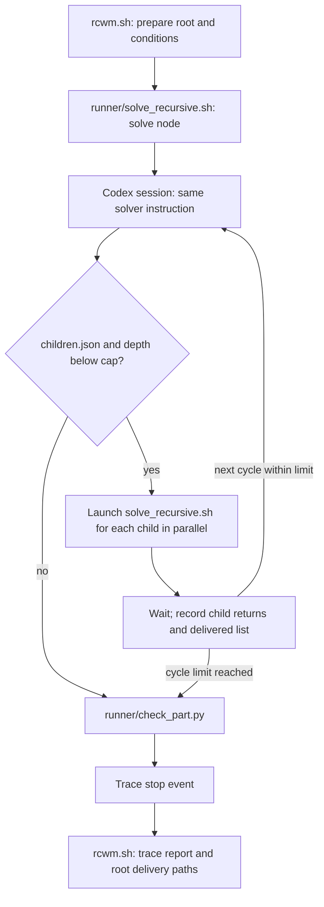

# Code structure and script reference

[Operating guide](usage.md) · [Runtime environment](environment.md) · [Reproduction guide](reproduce.md)

This map describes the checked-in scripts. Paths in commands are relative to the repository root;
paths in generated files are relative to the runtime/workspace unless stated otherwise.
`RCWM_CODE` means this checkout; `RCWM_ROOT` means the workspace containing the runtime tools and `runs/`.
They can be different directories. CLI signatures below use angle brackets for required arguments and
square brackets for optional arguments; replace those placeholders when running a command.

## Directory and file map

```text
RecursiveCWM_code/
  README.md                             project front page
  LICENSE                               MIT license for the code
  .gitignore                            excludes runtime tools, runs, caches, logs, and private Codex homes
  rcwm.sh                               single-scene entry point
  docs/
    usage.md                            complete operating guide
    code-structure.md                   this source map and interface reference
    environment.md                      runtime layout and paper versions
    paper-conditions.md                 conditions checklist and recorded run numbers
    reproduce.md                        table, figure, baseline, and ablation workflow
  solver/
    solver-template.md                  English recursive instruction used by default
  runner/
    solve_recursive.sh                  recursive session/child orchestration
    check_part.py                       component/module delivery and child-reference checks
    trace_report.py                     trace-to-tree report
  setup/
    setup_runtime.sh                    private Python, Node, three.js, and Chromium installation
    requirements-runtime.txt            Pillow and numpy pins
    requirements-metrics.txt            metric/figure/test dependencies
    smoke_test.mjs                      cube render and Python image check
  tools/
    new_workspace.sh                    workspace sharing an installed runtime
    make_codex_home.sh                  private Codex configuration, login copy, and skill
    resume_run.sh                       interruption recovery entry point
    diagnose_run.sh                     run-file diagnostics: tree, cost, deliveries, renders, and failures
    score_run.py                        one-run metrics, recursion, and usage report
    view.sh, view_server.mjs             interactive viewer launcher and HTTP server
    render_views.sh                     reference-camera and novel-view render wrapper
    hires_render.mjs                    high-resolution full-page render
    novel_views.mjs                     five additional camera views
    teaser_render.mjs                   canvas render with overlays hidden
    lib/viewer_harness.mjs              shared server, three.js hook, and Playwright helpers
  experiments/
    pickers.py                          method-specific render/completion selection
    eval_metrics.py                     record-only metrics for an image pair
    refresh_metrics.py                  aggregate scene/method metric CSV
    main_table.py                       main LaTeX and Markdown tables
    variant_table.py                    structural-control CSV and LaTeX table
    make_case_figures.py                comparisons and detail panels
    make_novel_views.py                 six-view grids and image fitting helpers
    run_matrix.sh                      scene × variant × repetition launcher
    pilot-scenes/
      city-full.png                    city reference composition
      school-block.png, police-corner.png, park-lake.png, shop-row.png
                                       four crops of that composition
      medieval-village.png             supplied WorldClaw figure crop
      REFERENCES.md                    provenance, crop coordinates, sizes, and hashes
      make_references.py               rebuild WorldClaw-derived reference crops
  baselines/
    variants/
      flat-zoom.md                     one editing trajectory, no child delegation
      local-global.md                  independent local parts, then mechanical composition
      global-local.md                  establish whole, refine parts, no whole revisitation
    external/
      README.md                        external baseline protocols
      run_seig.sh                      separate SEIG reproduction checkout
      run_viga.sh                      separate VIGA checkout and model shim
      run_img2threejs.sh                per-scene isolated img2threejs copy
  skills/worldgen-techniques/
    SKILL.md                           terrain and scene-building toolbox
  tests/
    test_runner_offline.sh             launch contract with a fake Codex executable
    fake-codex/codex                   deterministic root/children/resume stand-in
    test_camera_crop.py                camera-crop homography geometry tests
    test_check_part.py                 delivery shapes, nested child IDs, paths, and objects
```

The solver templates ask each node to compare matched reference/render views, resolve local differences,
prepare children where needed, integrate returned children, and complete unseen geometry in the same style.
They require `part.json` and `account.md`, reference a shared camera contract, and keep each child's writes
within its own node directory. The worldgen skill supplies techniques, not another orchestration loop.
The [reference inventory](../experiments/pilot-scenes/REFERENCES.md) explains the six supplied images
and the four WorldClaw-derived references that must be obtained or rebuilt separately.

## Execution flow



1. [rcwm.sh](../rcwm.sh) resolves its checkout, runtime, and instruction; checks the runtime executables,
   instruction, and Codex availability; selects the model/effort and prepares the private Codex home.
   It refuses a run whose root `target.png` already exists, copies the reference without resizing it,
   writes root `view.json` and `brief.md`, records `conditions.json`, and calls the runner with
   `runs/<run-name> scene - 0 <run-name>`.
2. [solve_recursive.sh](../runner/solve_recursive.sh) changes directory to `RCWM_ROOT`, creates the node
   and trace directories, computes instruction/camera/snapshot identifiers, and writes `manifest.json`
   if absent. It substitutes `__NODE__`, `__CHAIN__`, and `__DEPTH__` in the instruction to make `task.md`.
   At the depth cap it appends a note telling the solver to finish without requesting children.
3. Each active cycle starts or resumes `codex exec`. The runner explicitly passes the model, reasoning
   effort, `workspace-write`, network access, and the writable Chromium cache. New sessions receive the
   task text; resumed sessions receive a continuation message including `.children_done` when present.
   Output appends to `codex-run.log`; the first session ID is saved in `.sid`. The most recent parsed
   `tokens used` value from the accumulated log is written to `session_end` (zero if the log has no parsed value).
4. A nonempty `children.json` array below the depth cap launches one background runner process per child.
   The solver, not the runner, prepares each child's target crop, view, and brief. The parent runner waits
   for all processes, records each `child_return`, saves the names with a `part.json` in `.children_done`,
   and advances its cycle. Each child has its own Codex session; the parent resumes its original session.
5. At cycle start, an existing `children.json` becomes `children.json.prev`. On a fresh runner invocation,
   a node with `.sid`, no `part.json`, and unfinished previous children can emit `recover_children` and
   launch only the missing children before resuming the parent. Existing child deliveries are identified
   by file presence. This recovery still obeys the depth and cycle limits.
6. When there are no executable child requests or the cycle limit is exhausted, the runner checks
   `part.json` if present and emits `stop`. The entry point then prints a short tree summary and reports
   whether the root `part.json` exists. The trace distinguishes invalid artifacts from missing ones;
   the entry point's delivery message itself is based on file presence.

`max-depth=4` means root depth 0 through depth 4. `max-cycles=3` bounds this runner loop per invocation,
not the solver's internal edits or renders. If children are requested in the last cycle, they still run,
but there is no additional parent session in that invocation. Cycle numbering restarts when resuming
through a new runner invocation. Sibling parallelism has no separate cap in `solve_recursive.sh`.

The checker accepts a nonempty `components` collection (also as the top-level list), rejecting duplicate
IDs among dictionary entries, or an existing module path named by `module`, `entry`, `main`, or `file`;
the `export` symbol is optional. Children may be flat or nested node IDs, relative paths, or objects
carrying `part`/`path` or `id`/`name`/`node`. Node IDs (and their last path segment) are resolved against
the run's nearest `fractal/` root, the node's own directory, and its parent; explicit paths are relative
to the node. Child references must resolve to an existing file or a directory containing `part.json`.
It does not execute the export, judge image quality, or validate `account.md` and renders.
`visual_stop` records that the final structural check passed; it is not an independent visual evaluation.

## Run directory layout

```text
$RCWM_ROOT/runs/<run-name>/
  conditions.json                       entry-point configuration and available version information
  camera-contract.json                  root-solver camera contract, shared by descendants
  trace/
    events.jsonl                        runner-generated JSON object per event
    tree.json                           generated by trace_report.py
    recursion_report.md                 generated by trace_report.py
    score.json                          generated by score_run.py
  fractal/
    scene/                              root node (depth 0)
      target.png                        unchanged input reference
      view.json                         root framing note; child files describe their viewport
      brief.md                          node task and environment location
      manifest.json                     inherited interface/reference/camera/snapshot/instruction IDs
      task.md                           substituted instruction, including depth-cap note if needed
      codex-run.log                     appended Codex transcript across sessions
      .sid                              session ID used for resume
      children.json                     current requested child node names, when present
      children.json.prev                previous request, retained for recovery
      .children_done                    names of children whose part.json exists
      part.json                         component collection or module delivery (export optional)
      account.md                        solver's account of construction and completion
      index.html, *.js                   solver-generated viewer and scene modules
      final.png                         reference-camera render (actual declared name may differ)
      final-hires.png                   optional output of render_views.sh
      novel-views/                      optional output of render_views.sh / novel_views.mjs
        view-L35.png, view-R35.png, view-orbit.png, view-close1.png, view-close2.png
    <child>/                            same node layout; target.png is a magnified reference crop
```

Nodes are siblings under `fractal/`, even when their logical depths differ; the trace supplies the tree.
The matrix uses `runs/pilot/<scene>-<variant>-r<rep>/` instead. `conditions.json` is written by `rcwm.sh`;
the matrix calls the runner directly and does not write that file. Camera, program, account, and render
files depend on solver delivery; tree and score files depend on running the corresponding report tools.

`conditions.json` contains `run`, `reference`, `instruction`, `instruction_sha256` (12 hex characters),
`max_depth`, `max_cycles`, `model`, `reasoning_effort`, `codex_cli`, `codex_home`, `node`,
`three`, `playwright`, `python`, and `code_commit`. Version probes may be empty or null when unavailable.
`manifest.json` contains `interface_version: 1`, `reference_sha256` (12 hex characters or `pending`),
`camera_hash`, `parent_snapshot`, and `solver_hash`. It is created once and reused on subsequent invocations.

## Trace event schema

Every line in `trace/events.jsonl` has the following common fields, emitted by `log_ev` in the runner:

| Field | Type | Meaning |
|---|---|---|
| `run_id` | string | fifth runner argument; the entry point uses the run name |
| `node_id` | string | this node's directory name |
| `parent_id` | string | parent node name; `-` for the root |
| `depth` | integer | root is 0 |
| `cycle` | integer | current runner cycle, starting at 1; a final stop can be `max-cycles + 1` |
| `event` | string | one of the six event names below |
| `ts` | string | timestamp from `date -Is`, including timezone offset |
| `solver_hash` | string | first 12 hex characters of the selected instruction's SHA-256 |
| `camera_hash` | string | first 12 hex characters of the camera contract's SHA-256, or `none` |
| `parent_snapshot` | string | short Git HEAD resolved in the runtime context, or `none` |

| Event | Additional fields | Trigger |
|---|---|---|
| `session_start` | `model`: string; `reasoning`: string | immediately before starting/resuming Codex |
| `session_end` | `usage_total`: integer | after the Codex process returns; latest parsed usage from the accumulated node log |
| `child_call` | `child`: string | parent launches a child runner |
| `child_return` | `child`: string; `delivered`: boolean | after waiting for children; boolean tests `part.json` existence |
| `recover_children` | `children`: array of strings | missing prior children are relaunched without a parent session first |
| `stop` | `stop_reason`: string | `visual_stop`, `invalid_artifact`, or `no_artifact` |

Instruction, camera, and snapshot identifiers are captured once per runner invocation; a camera written
later does not change that invocation's `camera_hash`. `parent_snapshot` is not a new per-node commit.
An interrupted process may have a `session_start` without its matching end/stop. Report readers skip
unparseable lines and repair the older empty `usage_total` encoding to zero. `trace_report.py` builds
edges from `child_call`, sums session-end usage per node, and retains the latest recorded stop reason.
If a resumed session prints no usage, the runner can repeat an earlier session's parsed value;
the trace report then sums that repeated value too. Zero is used only when no usage can be parsed from the log.

## Entry point, runner, and setup interfaces

| Script | Arguments | Behavior and environment |
|---|---|---|
| [rcwm.sh](../rcwm.sh) | `<reference.png> <run-name> [max-depth=4] [max-cycles=3]` | Full launch described above. `RCWM_ROOT` defaults to `<repo>/runtime`; `RCWM_PROMPT` overrides the instruction; `RCWM_MODEL` / `RCWM_REASONING` default to `gpt-6-astra` / `high`. `RCWM_CLEAN_CODEX_HOME=0` disables private-home setup; `RCWM_CODEX_CONFIG` supplies a custom config. Incoming `CODEX_HOME` (otherwise `~/.codex`) supplies the login. Exports `RCWM_CODE`, `RCWM_MAXD`, and `RCWM_MAXCYC`; positional depth/cycles replace incoming values of those two variables. |
| [runner/solve_recursive.sh](../runner/solve_recursive.sh) | `<chain> <node> [parent_id=-] [depth=0] [run_id=r0]` | Chain is relative to `RCWM_ROOT` or absolute. Reads `RCWM_CODE`, `RCWM_ROOT`, `RCWM_MAXD=4`, `RCWM_MAXCYC=3`, `RCWM_PROMPT` (English template by default), `RCWM_MODEL`, `RCWM_REASONING`, `CODEX_HOME`, and `PLAYWRIGHT_BROWSERS_PATH` (default `~/.cache/ms-playwright`). Direct calls do not build a private home. |
| [runner/check_part.py](../runner/check_part.py) | `<part.json>` | Accepts nonempty component lists with unique IDs or existing `module`/`entry`/`main`/`file` paths with optional `export`. Resolves flat/nested child IDs against the run's `fractal/` root, node directory, and parent; also accepts relative paths and child objects. Prints `ok ...` on accepted structure; exits nonzero on failed checks. No custom environment variables. |
| [runner/trace_report.py](../runner/trace_report.py) | `<run-dir>` | Reads the trace, writes `trace/tree.json` and `trace/recursion_report.md`, and prints the report. No custom environment variables. |
| [setup/setup_runtime.sh](../setup/setup_runtime.sh) | `[runtime-root] [--metrics] [--python interpreter] [--conda env-name] [--node-from dir] [--recreate-venv]`; `-h` / `--help` | Default root is `<repo>/runtime` (the positional argument, not `RCWM_ROOT`, selects another location). `--python` overrides `PYTHON`; otherwise setup tries `python3.12`, then `python3`. `.python-version` selects CPython 3.12 for validation and new conda environments. Existing Python environments must also be 3.12. `RCWM_CONDA` selects conda/mamba/micromamba; `RCWM_NODE_VERSION=22.14.0` selects the Node download. `PLAYWRIGHT_BROWSERS_PATH` selects browser storage. Installs private Python packages, Node, three.js/Playwright, Chromium, and runs the smoke test. Existing tools are reused; Python packages are installed on each invocation. Conda supplies the interpreter for a private venv. `--recreate-venv` backs up and rebuilds it; old direct conda links migrate automatically. Python/pip installation runs in isolated mode. |
| [setup/smoke_test.mjs](../setup/smoke_test.mjs) | `[runtime-root]` | Defaults to `RCWM_ROOT`, then the current directory. Starts a temporary localhost server, renders a 320×200 cube with runtime Playwright, and checks for red pixels with runtime Python/Pillow/numpy. Writes `runs/.smoke/index.html` and `smoke.png`. Playwright uses `PLAYWRIGHT_BROWSERS_PATH`. |

Both requirement sets target CPython 3.12.x (see [Python compatibility](environment.md#python-compatibility)); setup resolves them together with `--metrics` and runs `pip check`.
The [runtime requirements](../setup/requirements-runtime.txt) pin Pillow 12.3.0 and numpy 2.5.2.
The [metrics requirements](../setup/requirements-metrics.txt) add CPU torch/torchvision, OpenCV,
SciPy, scikit-image, LPIPS, open_clip, and pytest. The metrics file includes the runtime requirements so it can also be installed directly. The [environment guide](environment.md) lists the paper versions.

## Workspace, recovery, and viewing tools

| Script | Arguments | Behavior and environment |
|---|---|---|
| [tools/new_workspace.sh](../tools/new_workspace.sh) | `<workspace-dir> [shared-runtime-root]` | Runtime argument defaults to `RCWM_RUNTIME`, then `<repo>/runtime`. Checks Python/Node, creates `runs/`, and symlinks `.venv` and `.render-tools`. Prints the absolute workspace path. Private Codex home is created later by the launch/home helper. |
| [tools/make_codex_home.sh](../tools/make_codex_home.sh) | `<workspace-root>` | Existing workspace required. Reads login from `CODEX_HOME` or `~/.codex`, writes `.codex-home` (mode 700) and `auth.json` (600), installs the worldgen skill, and prints the home path. Uses `RCWM_CODEX_CONFIG` or a two-line config from `RCWM_MODEL` / `RCWM_REASONING`. It does not export `CODEX_HOME` into the caller. |
| [tools/resume_run.sh](../tools/resume_run.sh) | `<run-name>` | Requires `$RCWM_ROOT/runs/<name>/fractal/scene`; exits early if root `part.json` exists, refuses a matching live runner, reuses an existing private home and refreshes its login from incoming `CODEX_HOME` or `~/.codex`. Reads `RCWM_ROOT`, `RCWM_PROMPT`, `RCWM_MAXD`, `RCWM_MAXCYC`; runner inherits model/effort and browser settings. Reuse the original settings: it does not load them from `conditions.json`. |
| [tools/diagnose_run.sh](../tools/diagnose_run.sh) | `<run-dir>` | Reads only the run's own files, with no model or network calls. Prints recorded conditions, tree depth/counts, sessions, tokens, wall time, stop reasons, delivered/missing parts, PNG render counts, and log failure signatures (Chromium, sandbox, disk, quota, connections, Python imports, three.js). Lists logs without a session ID and the root log header, then points to the root render and target. Requires `fractal/` and `python3`; no custom environment variables. |
| [tools/score_run.py](../tools/score_run.py) | `<scene-name> <run-dir> [label]` | Label defaults to the run directory's basename. Uses `RCWM_REFS` (default checked-in pilot scenes), `RCWM_ROOT` (otherwise inferred from run path), and optional `RCWM_SCORES` JSONL append destination. Sets `RCWM_OURS_CHAIN` to the supplied run before importing pickers. For a final render and existing reference, runs metrics with the same Python interpreter. Writes/prints `trace/score.json`: render/finality, metrics, nodes/depth/per-level counts, parts, tokens in millions, and wall minutes. Tokens come from all node logs; wall time is first-to-last trace event. |
| [tools/view.sh](../tools/view.sh) | `<run-dir-or-workspace-root> [port=8000] [host=127.0.0.1]` | A run is recognized by `fractal/scene`; its workspace is inferred two directories above. `RCWM_ROOT_OVERRIDE` overrides that inference (needed for deeper layouts such as matrix runs). Uses runtime Node, falling back to `node` on PATH; executes `view_server.mjs`. |
| [tools/view_server.mjs](../tools/view_server.mjs) | `<workspace-root> [--port N] [--host address]` | Direct invocation uses `RCWM_VIEW_PORT`, otherwise port 0 (OS-selected); explicit `--port` wins. Host defaults to localhost. Serves the workspace, hooks served three.js, and injects OrbitControls into HTML under `runs/`. Prints root viewer URLs for immediate children of `runs/`; deeper pages can be opened by their URL. `?clean=1` hides viewer overlays. Does not rewrite delivered files. |
| [tools/render_views.sh](../tools/render_views.sh) | `<run-dir> [scale=4] [ready-expr] [WxH]` | Requires root `part.json` and `index.html`. `RCWM_ROOT` overrides workspace inference (two directories above the run). Uses runtime Node, falling back to PATH. Frame size comes from `final.png`, `FINAL.png`, then `target.png`; otherwise harness default. Calls high-resolution and novel-view renderers in sequence. Inherits browser/ready-timeout settings below. |

Private-home creation installs the repo's worldgen skill but does not purge unrelated skill directories
already present in a reused private home. Use a fresh workspace for the paper's clean-home condition.
The root brief points to this checkout's environment guide; it does not copy that document into the runtime.

## Rendering harnesses

Run `.mjs` entry points with Node. All three renderers take a workspace root, an HTML page path under that
root, and an output path. Paths for outputs are interpreted by Node relative to its current directory
unless absolute. An empty optional argument can retain a default while supplying a later positional argument.

| Script | Positional arguments | Output |
|---|---|---|
| [tools/hires_render.mjs](../tools/hires_render.mjs) | `<workspace-root> <page-path> <out.png> [scale=2] [ready-expr] [WxH=1400x963]` | Raises renderer pixel ratio and captures the full page, including overlays; prints buffer/CSS sizes and page errors. |
| [tools/novel_views.mjs](../tools/novel_views.mjs) | `<workspace-root> <page-path> <out-dir> [ready-expr] [WxH=1400x963]` | Creates output directory and writes `view-L35`, `view-R35`, `view-orbit`, `view-close1`, `view-close2` PNGs. Uses ±35° azimuth, +25°/+30° orbit, and two 2.4× close-ups. Hides overlays; saves canvas data, falling back to a page screenshot. The browser device scale is 2; this script does not explicitly raise the renderer's pixel ratio. |
| [tools/teaser_render.mjs](../tools/teaser_render.mjs) | `<workspace-root> <page-path> <out.png> [scale=4] [ready-expr] [WxH=1400x963] [hide-name-regex]` | Raises renderer pixel ratio and writes only the WebGL canvas against white, with page furniture hidden. Optional case-insensitive regex hides named scene objects. Prints output dimensions, hidden names, and page errors. |

[tools/lib/viewer_harness.mjs](../tools/lib/viewer_harness.mjs) is an imported library, with no CLI.
It exports `HOOK`, `DEFAULT_READY`, `READY_TIMEOUT`, `serveRoot`, `resolvePlaywright`, `openViewer`,
and `HIDE_FURNITURE`. Its temporary HTTP server binds localhost on a free port, appends `HOOK` to served
`three.module.js`, and maps missing `/vendor/` paths to runtime `node_modules`. The hook remembers the
renderer and the rendered scene with the most meshes, along with that scene's camera.

Playwright resolution tries the supplied workspace, `RCWM_ROOT`, then `<repo>/runtime` relative to this
checkout; installed workspaces normally use the first two locations.
Browser storage follows `PLAYWRIGHT_BROWSERS_PATH`. Readiness checks `window.ready`, `__SCENE_READY__`,
`sceneReady`, `__READY__`, or `renderReady` unless a custom expression is supplied.
`RCWM_READY_TIMEOUT_MS` defaults to 180000; after a timeout the harness waits another 20 seconds, then
waits up to 30 seconds for the renderer hook. The three entry points exit with `hookMissing` if no hook
was observed. High-resolution and teaser renderers expect the output parent directory to exist.

## Metrics, tables, figures, and matrix

These scripts consume completed or interrupted runs after generation. Their scores do not gate the solver.
Picker environment variables are listed in the next section and apply wherever that picker is used.

| Script | Arguments | Behavior and environment |
|---|---|---|
| [experiments/eval_metrics.py](../experiments/eval_metrics.py) | `<reference.png> <render.png> [--json out] [--crops N]`; `-h` / `--help` | Resizes render to reference dimensions, emits a JSON metric record, optionally writes it to `--json`. `--crops` defaults to 8 of a fixed 3×3 candidate grid. Reports PSNR, SSIM and tile summaries, edge F1, color EMD, palette coverage/proportion error, detail SSIM, LPIPS, and CLIP similarity. Optional metric failures yield null fields. No custom environment variables; first learned-metric use may download weights. |
| [experiments/pickers.py](../experiments/pickers.py) | Imported module; no CLI | Returns `(render_path_or_None, final_boolean)` for each method; rules and variables below. |
| [experiments/refresh_metrics.py](../experiments/refresh_metrics.py) | None | Requires `RCWM_ROOT`; uses `RCWM_REFS`, `RCWM_METRICS_CSV` (default `runs/pilot/metrics/all-methods-full.csv` under runtime), and all method pickers. Iterates the ten paper scenes and four methods. Reuses rows with the same render path/finality and existing PSNR; removes rows with no render, computes other rows through runtime Python, and rewrites CSV. Create the CSV parent directory first. |
| [experiments/main_table.py](../experiments/main_table.py) | None | Requires `RCWM_ROOT`; reads `RCWM_METRICS_CSV`. Writes `casemetrics-table.tex` and `.md` beside it, including only `final=True` rows with PSNR and bolding the per-scene best metric. `RCWM_NO_PAPER=1` keeps output local; otherwise requires `RCWM_PAPER` and attempts to replace the matching table in `sections/04_experiments.tex`. |
| [experiments/variant_table.py](../experiments/variant_table.py) | None | Requires `RCWM_ROOT`; uses `RCWM_REFS` and `RCWM_VARIANTS_TEX` (default runtime `runs/pilot/metrics/variants-table.tex`). Reads `r1` for school-block and medieval-village across five variants. Creates `variants.csv` and the LaTeX table; requires at least one run. Cost comes from node logs; time is the union of paired session intervals, excluding gaps. Finality requires root `part.json` and a root stop event. Incomplete metrics remain in CSV but are blanked in LaTeX; cost/time columns are hidden by the checked-in `SHOW_COST=False`. |
| [experiments/make_case_figures.py](../experiments/make_case_figures.py) | `<outdir> [--full S1,S2] [--ours S3,S4] [scene ...] [crops]` | Requires `RCWM_ROOT`; uses `RCWM_REFS`, picker variables, `RCWM_OURS_OVERRIDE` (`scene=/path.png,...`), `RCWM_CASE_CANW=1280`, and `RCWM_CASE_FIX` (`scene=idx:fx,fy,ws;idx:fx,fy,ws` with scenes separated by `\|`). Writes comparison `case-<scene>.png`, two-column `case-ours-<scene>.png`, and optionally `case-grid-crops.png`. With no selectors, chooses the five whole scenes and the crop grid. Output directory must exist. |
| [experiments/make_novel_views.py](../experiments/make_novel_views.py) | `<out.png>` | Requires `RCWM_ROOT`; uses our chain/run picker settings. Requires the reference-camera render and all five novel views for each of ten scenes; raises on missing views. Writes a single grid, trimming background and fitting native images to column sizes. Also exports `content_box` and `fit_content`, used by case figures. Output parent must exist. |
| [experiments/run_matrix.sh](../experiments/run_matrix.sh) | `"<scenes>" "<variants>" [reps=1] [concurrency=4]` | Reads `RCWM_CODE`, `RCWM_ROOT`, `RCWM_REFS`; inherits runner model/effort/cycles, browser settings, and `CODEX_HOME`. Uses fixed variant prompts/depths below. Creates root inputs and calls the runner directly, skips existing root parts, appends `results.csv`, and ends with `matrix.log`. Concurrency checks all machine `codex exec` processes before each launch, with pauses of 120 seconds while full and 20 seconds between launches; it does not cap subsequent children. |
| [experiments/pilot-scenes/make_references.py](../experiments/pilot-scenes/make_references.py) | `<page-render-dir> <out-dir>` | Crops `fig04.png`, `fig09.png`, `fig10.png`, `fig12.png`, `fig15.png` using the source table, scales coordinates relative to 8516-pixel page width, resizes four crops, and leaves valley-village unresized. Creates output directory and prints sizes and 16-character SHA-256 prefixes. Missing page images are reported and skipped. No custom environment variables. |

Case figures register renders to the reference for locating detail windows (ORB/RANSAC with an ECC fallback),
then sample those windows from native images. Automatic full-comparison windows favor our SSIM difference
over the best baseline subject to structure/spacing checks; two-column windows favor edge density.
`RCWM_CASE_FIX` supplies explicit windows. This figure layout/registration does not change the image-pair
metric computation. Both figure scripts use `/usr/share/fonts/truetype/dejavu/DejaVuSans-Bold.ttf`.

The matrix's `results.csv` columns are `scene,variant,rep,chain,start,end,stop_reason,max_depth,sessions,usage_last,part_delivered`.
`usage_last` is the last trace usage value, not total run tokens. Rows are appended under `flock` when available,
with a plain append fallback. The matrix does not call the private-home helper or create a conditions record.

| Matrix variant | Instruction file | Depth cap |
|---|---|---|
| `flat` | [flat-zoom.md](../baselines/variants/flat-zoom.md) | 0 |
| `localglobal` | [local-global.md](../baselines/variants/local-global.md) | 1 |
| `globallocal` | [global-local.md](../baselines/variants/global-local.md) | 0 |
| `twolevel` | [solver-template.md](../solver/solver-template.md) | 1 |
| `recursive` | [solver-template.md](../solver/solver-template.md) | 4 |

## Render selection rules

The shared rules live in [experiments/pickers.py](../experiments/pickers.py).
`_img_ok` requires a file of at least 1000 bytes that Pillow can verify. Explicit final filenames use this
check without a minimum image width/height. Generic `newest` searches additionally require width ≥ 400
and height ≥ 300, exclude diagnostic/reference/side-view names from `EXCL`, and reject paths containing
`audit`, `inventory`, `evidence`, `material`, or `mask`. They select by modification time, optionally
preferring the first matching filename keyword supplied by the caller. No numeric fidelity score selects a final render.

| Method | Rule in order | Completion flag |
|---|---|---|
| Ours | Root `final.png`, then `FINAL.png`; if `part.json` exists, declared render fields, then exact recognized filenames; otherwise latest eligible `round*[0-9].png`, `assembled*[0-9].png`, `handoff.png`, or `blockout*.png`. | The explicit final paths return true (including `final.png`/`FINAL.png` without checking `part.json`); generic fallback returns false. A delivered part with no recognized final render emits a warning. |
| SEIG | `renders/commit_camera.png`; otherwise newest eligible `renders/commit_*.png`. | Only a valid `commit_camera.png` returns true. |
| VIGA | Highest numbered render round containing a valid PNG; within it prefer `Camera.png`, otherwise largest file. Apply the launch selection/fallback below. | A selected current-launch image plus `Cleanup finished` in its log, without `Failed to get model response`. Historical fallbacks are false. |
| img2threejs | Special paper city-full path unless disabled; otherwise search the isolated scene recursively for `final-render.png`, then `render-hires.png`, excluding the copied `img2threejs/` source subtree. Within a filename class use the newest valid image. | Special city-full image returns true if valid; isolated runs require `ALL_DONE` in `stages.log`. |

For ours, declared fields are tried in this order: `final_render`, `reference_view`, `render`, `main_render`,
`final`, `front`, first from `evidence` or then the same top-level key. Paths are relative to the root node.
The recognized filename fallback is exactly:

```text
render-final.png, final-main.png, preview-final.png, final-render.png, final-fixed.png,
render-fixed.png, main-final.png, final-view.png, final-front.png, renders/final-front.png,
renders/final.png, evidence/final.png, review/final.png, render/final.png, final-reference.png
```

`RCWM_OURS_CHAIN` supplies a chain path/pattern with `{scene}` substitution (absolute or relative to runtime).
Otherwise chains are `runs/pilot/<scene>-recursive-<rep>`, with `r1` default and per-scene overrides from
`RCWM_OURS_RUN=scene=r2,...`. These settings are read when the module is imported.
`RCWM_OURS_OVERRIDE` is read only by `make_case_figures.py`, not by `pickers.ours` or the metrics tools.

SEIG uses `RCWM_SEIG` plus `RCWM_SEIG_RUN` (default `runs/pilot-{scene}`, or an absolute pattern).
VIGA uses `RCWM_VIGA` and `RCWM_VIGA_TESTID` (default `pilot2-{scene}`). An explicitly set test-ID pattern
disables historical fallback. Otherwise non-`pilot2-` launches may supply an older candidate, prioritizing
a launch named exactly for the scene and then its round. A current incomplete run replaces that fallback
only when its round is at least 5 and no lower than the older candidate's round.

img2threejs uses `RCWM_I2T_ISO/<scene>`. Without `RCWM_I2T_ISO_ALL=1`, city-full instead uses the paper path
`$RCWM_ROOT/runs/pilot/city-full-img2threejs-r1/render-hires.png`. Set `RCWM_I2T_ISO_ALL=1` to select isolated
outputs for every scene, including city-full.

`variant_table.py` has its own `pick` function: it tries `evidence.final_render`, `evidence.render`,
`evidence.final`; then `final.png`, `FINAL.png`, `render.png`, `evidence/final.png`, `evidence/render-final.png`,
`review/final.png`; then generic intermediate patterns (including an evidence/integrated pattern, which
the shared generic path filter excludes). Its finality check is separate from image selection, as described above.

## External baselines

The [baseline protocol guide](../baselines/external/README.md) describes these separate projects.
All three launchers return after starting a background process; follow their logs for actual completion.
These wrappers do not install their external checkouts or implement the main entry point's private-home setup.

| Script | Arguments | Required/optional environment and behavior |
|---|---|---|
| [baselines/external/run_seig.sh](../baselines/external/run_seig.sh) | `<scene> <reference.png>` | Requires `RCWM_SEIG` (checkout with `seig/` and `CODEX_BRIEF.md`) and `RCWM_ROOT`; optional `SEIG_PY` overrides runtime Python, `RCWM_RUN_PREFIX` defaults to `pilot`. Creates `runs/<prefix>-<scene>` through `seig.cli` if absent, substitutes that run into the brief, and starts Codex under `nohup`, logging to `codex-run.log`. Use an absolute reference path because it changes into the SEIG checkout. Model/effort come from the Codex environment/configuration, including `CODEX_HOME`; this wrapper does not pass the RCWM model overrides. |
| [baselines/external/run_viga.sh](../baselines/external/run_viga.sh) | `<scene>` | Requires `RCWM_VIGA`, `BLENDER`, prepared `data/pilot/<scene>/target.png`, and an already running shim. `VIGA_SHIM_PORT=8102`; `RCWM_RUN_PREFIX=pilot2`. Sets `OPENAI_BASE_URL` to localhost shim and `OPENAI_API_KEY=not_used`; invokes VIGA's `.venv/bin/python` runner with one task, `--model gpt-5.6-sol`, and `--max-rounds 20`. Logs to `runs/<test-id>.log`; VIGA renders live under `output/static_scene/<test-id>/<scene>/renders/<round>/`. The shim's configuration determines the executor behind the endpoint model name; verify it separately. |
| [baselines/external/run_img2threejs.sh](../baselines/external/run_img2threejs.sh) | `<scene> <reference.png>` | Requires `RCWM_ROOT` with `vendor/img2threejs` and `RCWM_I2T_ISO`. Refuses an existing scene directory; copies the upstream tree and reference, writes tool locations to `ENVIRONMENT.md`, and starts a background native Codex session. After stage 1 it resumes the same session if its shell check for top-level `final-render.png` and `render-hires.png` fails (that check succeeds only when both exist). Writes `STAGE1_DONE`, optional `STAGE2_DONE`, and `ALL_DONE` in `stages.log`, with `codex-run.log` and `runner.log`. Inherits Codex model/effort/configuration rather than passing RCWM model overrides. |

## Tests

| File | Arguments / invocation | What it checks |
|---|---|---|
| [tests/test_runner_offline.sh](../tests/test_runner_offline.sh) | `[runtime-root]`, default `RCWM_ROOT` then `<repo>/runtime` | Creates a temporary workspace under `TMPDIR` (default `/tmp`) using the installed Python/Node paths, installs a fake login and fake Codex on PATH, then launches `rcwm.sh`. Checks private-home contents, recorded model/effort/hash, two child deliveries, root resume, trace event presence, tree size/depth, and structural delivery. Prints `offline runner test ok (...)` and removes the workspace on success; preserves it on failure. No model call. |
| [tests/fake-codex/codex](../tests/fake-codex/codex) | Test stand-in for `codex --version` and `codex exec ... [resume <sid> <message>]` | Parses the runner's `--cd`, config/sandbox options, and task/resume text. Creates two fixed child nodes for the initial root call, delivers child modules, then delivers the root on resume. Emits synthetic session IDs and usage text; it does not perform scene reconstruction or validate every forwarded flag. |
| [tests/test_setup_runtime.py](../tests/test_setup_runtime.py) | `python3 -m unittest discover -s tests -p test_setup_runtime.py` (also collected by pytest) | Offline setup regression tests using simulated Python/conda executables. Checks interpreter selection, early rejection, environment backup/recovery, conda migration, isolated Python/pip calls, and dependency installation. No downloads or renderer. |
| [tests/test_camera_crop.py](../tests/test_camera_crop.py) | Collected by `python -m pytest tests/` | Two numpy geometry tests: crop homography projection consistency and focal-length scaling. No custom environment variables or standalone CLI. |
| [tests/test_check_part.py](../tests/test_check_part.py) | Collected by `python -m pytest tests/` | Six tests invoke the checker in a subprocess against temporary deliveries: module/export, entry without export, component lists and duplicate IDs, flat/nested child IDs, path/object children, and missing children/modules or empty deliveries. No custom environment variables or standalone CLI. |

Run the offline, geometry, and delivery-check tests as shown in the [operating guide](usage.md#14-tests).
The [smoke renderer](../setup/smoke_test.mjs) checks the actual Chromium/three.js/Python rendering path separately.
